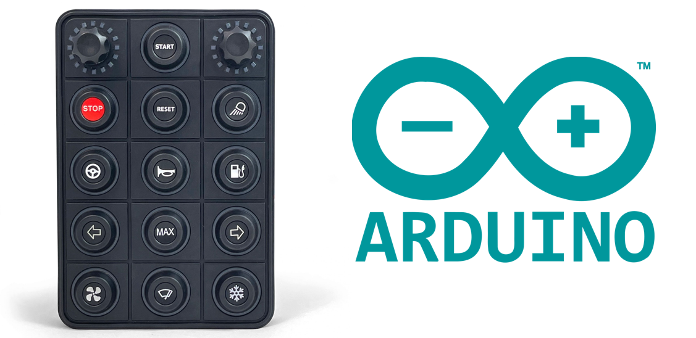

# Arduino library for interfacing Blink Marine PKP-3500-SI-MT via CANopen

 
This library enables control of a PKP-3500-SI-MT CAN Keypad using any CAN bus interface with an Arduino-compatible microcontroller. This project is a fork of [PKP2600SI-Arduino-CAN-Controller](https://github.com/Mbmatthews/PKP2600SI-Arduino-CAN-Controller), created to extend support to the PKP-3500-SI-MT model. Due to inconsistencies in the interface and varying hardware requirements, the library has been rewritten to be hardware-independent with minimal dependencies.

## Caution
This library is still under development - The arduino example sketches have not been thoroughly tested. Use at your own risk.

## Features
- Hardware Independence: Works with any CAN hardware interface compatible with Arduino.
- Message Processing: Processes messages from the PKP-3500-SI-MT and notifies if a message is not consumed.
- Callback Function: Customizable callback function for sending messages to the CAN network.
- Support for Multiple Models: Designed to support various Blink Marine Keypads. So far tested with PKP-3500-SI-MT only.

## Future Development
This library currently supports all basic functionalities of the keypads. However, these versatile devices have many more features that will be unlocked in future updates. If your application requires a functionality that is not yet available, please reach out or consider contributing to the library.
Next steps may include:
- Read and write additional service data objects (SDO)
- Encoder led blinking
- Examples for additional microcontroller boards
- Error handling and fallback mechanisms

## Contributing
Contributions are highly appreciated. To contribute:

1. Fork the repository.
2. Create a new branch for your feature or bug fix.
3. Commit your changes and push the branch.
4. Open a pull request describing your changes.

We use pre-commit hooks and clang-format to ensure code quality and maintain coding standards. Make sure to have these tools installed for compliance with our guidelines.

## License
This project is licensed under the MIT License. See the [LICENSE](LICENSE) file for details.

## Contact
For questions or support, please open an issue.
